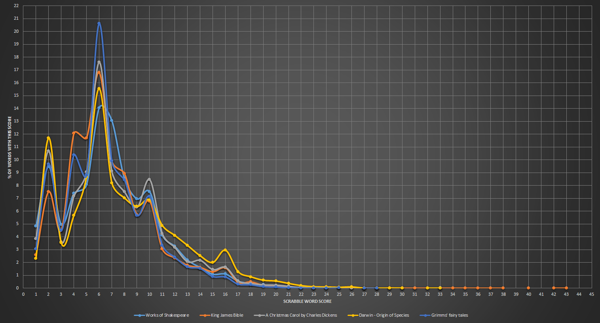
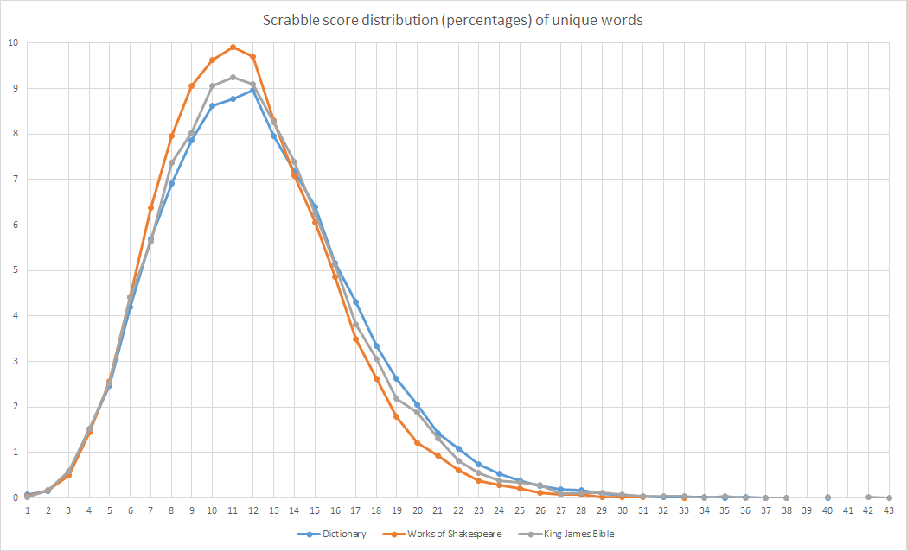

# What literature has the best Scrabble words?

I started making an interpreter for [Beatnik](https://esolangs.org/wiki/Beatnik) but got sidetracked doing this.

# Scrabble score distribution

I plotted the percentage of words with each scrabble score for the following public domain documents:
* Works of Shakespeare
* King James Bible
* Dickens - A Christmas Carol
* Darwin - Origin of Species
* Grimms' fairy tales

It seems for a sufficiently large/varied text, it will follow quite a similar pattern.

This pattern appears to be tied to frequency of identical words as much as the distribution of scores throughout the English language.
To prove this, below I plot _only_ unique words against words from a dictionary wordlist. The shape is much simpler.

# Acknowledgements
* [bostic](https://svnweb.freebsd.org/csrg/share/dict/)
* [Paolo Bergantino](http://stackoverflow.com/a/772929)
* [Project Gutenberg](http://www.gutenberg.org/)